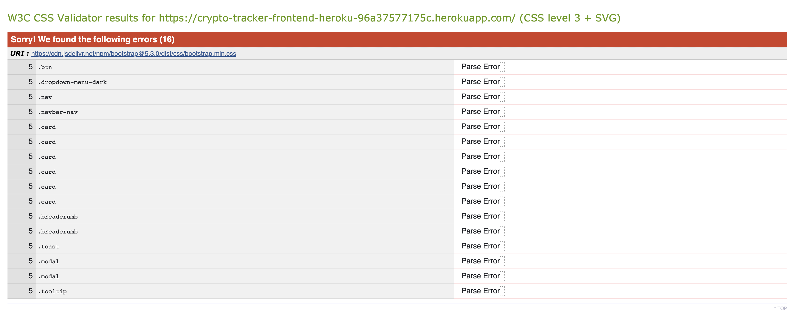
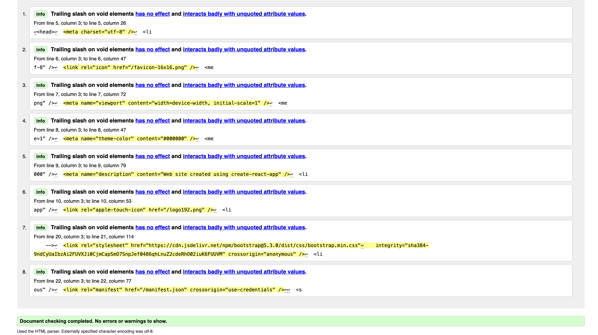
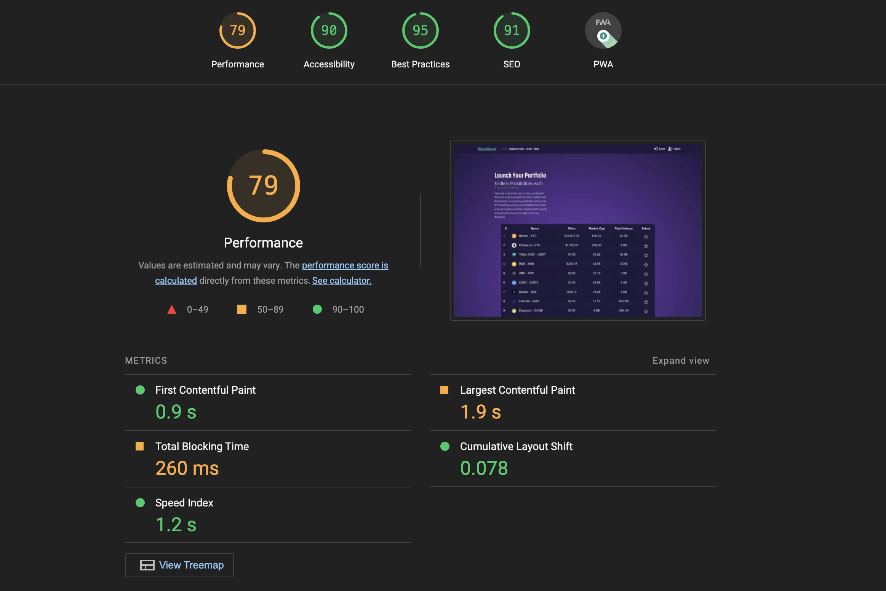
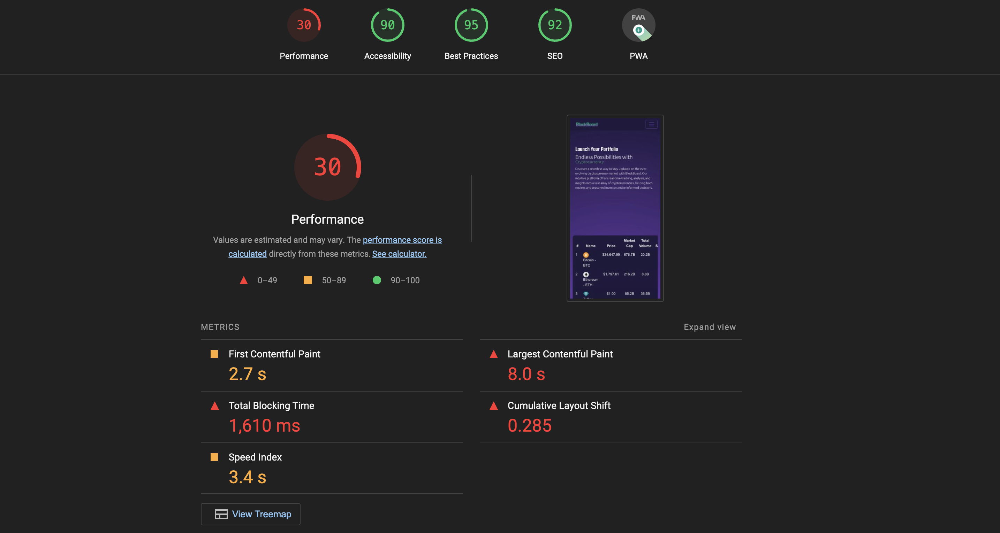

# CryptoTracker Frontend

CryptoTracker is an innovative web application designed to monitor and analyze the cryptocurrency market. This project is the culmination of efforts to utilize React and modern web development practices to provide real-time data and interactive features for both novice and seasoned cryptocurrency enthusiasts.

---

## Table of Contents

- [Overview](#overview)
- [React Architecture](#react-architecture)
- [Project Goals](#project-goals)
- [User Experience (UX)](#ux)
  - [Strategy](#strategy)
  - [Scope](#scope)
  - [Structure](#structure)
  - [Skeleton](#skeleton)
  - [Surface](#surface)
    - [Design](#design)
    - [Interaction Design](#interaction-design)
- [Agile Methodology](#agile-methodology)
- [Features](#features)
  - [Implemented Features](#implemented-features)
  - [Future Enhancements](#future-enhancements)
- [Responsive Design](#responsive-design)
- [Technologies Used](#technologies-used)
- [Validation](#validation)
  - [CSS](#css)
  - [Html](#html)
  - [Lighthouse](#lighthouse)
  - [ESLint](#eslint-validation)
- [Testing](#testing)
- [Deployment](#deployment)
- [Credits](#credits)
  - [Content and Media](#content-and-media)
  - [Acknowledgements](#acknowledgements)

---

## Overview

CryptoTracker provides a centralized platform for tracking cryptocurrency performance. The application is built with React.js for seamless user interaction and state management, integrated with backend services for up-to-date cryptocurrency data.

_Live Demo: [CryptoTracker Live](#)_

## React Architecture

CryptoTracker's frontend, built with React, emphasizes modularity and reusability in its component structure. This architecture aligns with specific user stories, enhancing the overall user experience:

### Components and Pages Documentation

- **Avatar Component** (`Avatar.js`):

  - **User Story 7.1**: Enables users to upload and display personalized profile images, fostering individuality within the community.

- **Favourite Component** (`Favourite.js`):

  - **User Story 5.1**: This reusable button lets users mark cryptocurrencies as favorites, providing a tailored experience by highlighting preferred currencies.

- **Footer Component** (`Footer.js`):

  - **User Story 1.4**: Consistently present across the site, offering navigational aids and contact information, contributing to a cohesive user experience.

- **NavBar Component** (`NavBar.js`):

  - **User Story 1.3**: Utilizes the custom hook `useClickOutsideToggle` for responsive navigation, enhancing usability across various pages.

- **CurrencyPostForm and ShowPosts Components** (`CurrencyPostForm.js` & `ShowPosts.js`):

  - **User Story 6.1 & 6.2**: These components manage the interactive aspects of the cryptocurrency forum, enabling users to post comments and engage with the community.

- **UserProfilePage Component** (`UserProfilePage.js`):

  - **User Story 7.1 & 7.2**: Allows users to update their profile details, reflecting a responsive and user-centric design approach.

- **Currencies Component** (`Currencies.js`):

  - **User Story 3.1 & 3.2**: Implements search, filter, and listing functionalities, making it easy for users to find and explore cryptocurrencies.

- **LandingPage and LandingPageCurrencies Components** (`LandingPage.js` & `LandingPageCurrencies.js`):

  - **User Story 3.1 & 3.2**: The LandingPage provides a welcoming introduction to the site, while LandingPageCurrencies showcases top cryptocurrencies, aligning with the user’s interest in market trends.

- **ForumPage and ForumPagePosts Components** (`ForumPage.js` & `ForumPagePosts.js`):

  - **User Story 6.1 & 6.2**: These components foster community engagement by displaying forum posts and enabling interactive discussions related to cryptocurrencies.

- **Dashboard Component** (`Dashboard.js`):
  - **User Story 7.2**: Personalizes user experience by displaying a dashboard of selected and favored currencies.

### Contribution of React Library to User Experience

- **React Router** (`react-router-dom`): Facilitates seamless navigation without page reloads, enhancing the user's journey through the application.
- **State and Effect Hooks**: Used across various components like `Currencies` and `ForumPagePosts` for dynamic content rendering and interactive features, significantly improving the site's responsiveness and interactivity.

### Search, Filter, and List Functionality

- **Implemented in Currencies Component**:

  - The `Currencies.js` file incorporates these functionalities, allowing users to easily search and filter through a vast array of cryptocurrencies. It aligns with **User Story 3.1 & 3.2**, enhancing the user's ability to quickly find and analyze currencies.

- **ForumPagePosts Component**:
  - Implements a filter functionality in the community forum, enabling users to sort posts by specific currencies. This feature, addressing **User Story 6.1 & 6.2**, makes it easier for users to engage in relevant discussions.

### Utility: numberFormatting.js

CryptoTracker incorporates a key utility, `numberFormatting.js`, located within the utils directory. This utility plays a vital role in the application's user experience:

- **Functions**: It includes essential functions like `formatNumbers` and `formatLargeNumbers`, crucial for converting numerical data into a format that is easy to read and understand by users.
- **User-Friendly Presentation**: These functions are used to present financial figures, such as cryptocurrency prices and market caps, in a way that is immediately comprehensible, enhancing the user's interaction with data.
- **DRY Principle**: By exporting these functions, they can be imported and reused across multiple components, adhering to the "Don't Repeat Yourself" (DRY) principle. This approach significantly reduces code redundancy.
- **Simplifies Maintenance**: This centralized formatting logic simplifies maintenance and updates, as changes to number formatting need to be made only in one place.

## Project Goals

### Overall Objective

- The primary goal of CryptoTracker is to provide a user-friendly platform for real-time monitoring and analysis of the cryptocurrency market. The aim is deliver a product that is:

### Main Functional Goals

- Easy-to-use interface that allows seamless navigation, enabling users to find currency data effortlessly.
- Implement a secure authentication system that supports a personalized and secure user experience.
- Foster an interactive community by allowing users to communicate with each other, thereby encouraging active participation.
- Create detailed user profiles that showcase personal information and preferences, enhancing community connection.
- Integrate complete create, read, update, and delete (CRUD) capabilities for user posts and user interactions to empower users with content control.
- Ensure the platform is accessible and functional across a range of devices, promoting inclusivity and convenience.

### User Centric Goals

- Enable users to posts and publish images, facilitating knowledge sharing and community growth.
- Allow users to edit and update their posts and profile information, maintaining a dynamic and current platform.
- Give users the ability to indicate their favourite currencies, curating a personalized feed of relevant price action.

## UX

This site was created according to the Five Planes Of Website Design.

### Strategy

| EPIC                              | ID  | User Story                                                                                                                                                                         | Project Goals Mapped                                                                                                        |
| --------------------------------- | --- | ---------------------------------------------------------------------------------------------------------------------------------------------------------------------------------- | --------------------------------------------------------------------------------------------------------------------------- |
| **Project Inception**             |     |                                                                                                                                                                                    |                                                                                                                             |
| _Base Setup_                      | 1.1 | As a developer, I need to create the base setup and structure so that other pages can reuse the layout.                                                                            | Easy-to-use interface that allows seamless navigation, enabling users to find currency data effortlessly.                   |
|                                   | 1.2 | As a developer, I need to create static resources so that images, CSS, and JavaScript work on the website.                                                                         | Ensure the platform is accessible and functional across a range of devices, promoting inclusivity and convenience.          |
|                                   | 1.3 | As a site user, I can see a navigation menu so that I can easily navigate through the site.                                                                                        | Easy-to-use interface that allows seamless navigation, enabling users to find currency data effortlessly.                   |
|                                   | 1.4 | As a site user, I can see the footer throughout the entire site.                                                                                                                   | Ensure the platform is accessible and functional across a range of devices, promoting inclusivity and convenience.          |
| **User Account Management**       |     |                                                                                                                                                                                    |                                                                                                                             |
| _Registration and Authentication_ | 2.1 | As a new visitor, I want to sign up for a new account so that I can access registered user features.                                                                               | Implement a secure authentication system that supports a personalized and secure user experience.                           |
|                                   | 2.2 | As a returning user, I want to log in to my account so that I can access my personalized settings and community features.                                                          | Implement a secure authentication system that supports a personalized and secure user experience.                           |
|                                   | 2.3 | As a user, my username is visible on the navbar as a clear indication of my authentication status.                                                                                 | Implement a secure authentication system that supports a personalized and secure user experience.                           |
| **Landing Page Display**          |     |                                                                                                                                                                                    |                                                                                                                             |
| _Crypto Market Overview_          | 3.1 | As a visitor, I want to see the top 10 cryptocurrencies on the landing page so that I can quickly understand the most valuable currencies.                                         | Enable users to posts and publish images, facilitating knowledge sharing and community growth.                              |
|                                   | 3.2 | As a user, I want to click on a "read more" button to view more information about a range of cryptocurrencies so that I can explore beyond the top 10.                             | Enable users to posts and publish images, facilitating knowledge sharing and community growth.                              |
|                                   | 3.3 | As a user, I want to see additional information about the functions of the page to make it more attractive to sign up for all features.                                            | Foster an interactive community by allowing users to communicate with each other, thereby encouraging active participation. |
| **Cryptocurrency Details**        |     |                                                                                                                                                                                    |                                                                                                                             |
| _Crypto Information_              | 4.1 | As a user, I want to click on a cryptocurrency to see detailed price data, charts, and information about the currency so that I can make informed decisions.                       | Enable users to posts and publish images, facilitating knowledge sharing and community growth.                              |
| **User Interaction**              |     |                                                                                                                                                                                    |                                                                                                                             |
| _User Preferences_                | 5.1 | As a registered user, I want to "like" cryptocurrencies of my choice so that I can personalize my experience and keep track of specific currencies.                                | Give users the ability to indicate their favourite currencies, curating a personalized feed of relevant price action.       |
|                                   | 5.2 | As a registered user, I want to "dislike" cryptocurrencies of my choice so that I can personalize my experience and remove specific currencies from my dashboard.                  | Give users the ability to indicate their favourite currencies, curating a personalized feed of relevant price action.       |
| **Community Engagement**          |     |                                                                                                                                                                                    |                                                                                                                             |
| _User Comments_                   | 6.1 | As a registered user, I want to post comments on each specific cryptocurrency's page so that I can share my insights and opinions with the community.                              | Foster an interactive community by allowing users to communicate with each other, thereby encouraging active participation. |
|                                   | 6.2 | As a user (registered or not), I want to read comments on a cryptocurrency's page so that I can understand the community's perspective on that cryptocurrency.                     | Foster an interactive community by allowing users to communicate with each other, thereby encouraging active participation. |
| _Comment Management_              | 6.3 | As a registered user, I want to edit my comments on a cryptocurrency's page so that I can correct or update my insights.                                                           | Allow users to edit and update their posts and profile information, maintaining a dynamic and current platform.             |
|                                   | 6.4 | As a registered user, I want to delete my comments on a cryptocurrency's page so that I can remove opinions or information I no longer want to share.                              | Allow users to edit and update their posts and profile information, maintaining a dynamic and current platform.             |
|                                   | 6.5 | As an admin user, I want to read, edit, and delete any user's comments on a cryptocurrency's page so that I can moderate and maintain the quality of community discussions.        | Allow users to edit and update their posts and profile information, maintaining a dynamic and current platform.             |
| **User Profile Management**       |     |                                                                                                                                                                                    |                                                                                                                             |
| _Profile Customization_           | 7.1 | As a registered user, I want to update my profile details (name, info, profile picture) so that I can share more relevant information about myself with the community.             | Create detailed user profiles that showcase personal information and preferences, enhancing community connection.           |
|                                   | 7.2 | As a registered user, I want a personal landing page showing my liked cryptocurrencies and the median price development of my portfolio so that I can easily monitor my interests. | Give users the ability to indicate their favourite currencies, curating a personalized feed of relevant price action.       |
| **User Feedback**                 |     |                                                                                                                                                                                    |                                                                                                                             |
| _Registration Feedback_           | 8.1 | As a user, I want to receive feedback when I try to register with an email that's already in use so that I know I might already have an account.                                   | Implement a secure authentication system that supports a personalized and secure user experience.                           |
| _Login Feedback_                  | 8.2 | As a user, I want to be informed if my login credentials are incorrect so that I can re-enter them or reset my password. displayed.                                                | Implement a secure authentication system that supports a personalized and secure user experience.                           |
| _Comment Posting Feedback_        | 8.3 | As a user, I want feedback when my comment fails to post so that I can try again or report the issue.                                                                              | Foster an interactive community by allowing users to communicate with each other, thereby encouraging active participation. |
| _Empty Comment Alert_             | 8.4 | As a user, I want to be alerted if I try to submit an empty comment so that I can provide content before posting.                                                                  | Foster an interactive community by allowing users to communicate with each other, thereby encouraging active participation. |

 
 

### Scope

The scope encompasses the following:

- Development of a responsive and intuitive interface.
- Implementation of key features such as real-time tracking, user accounts, and interactive charts.
- Secure and efficient handling of user data and preferences.

## Structure

CryptoTracker is meticulously designed with a focus on user experience and is organized into several key pages, each crafted to cater to the needs of its diverse user base. The content and features available on these pages vary based on user authentication status and the specific role they hold within the platform. Below is an overview of the primary pages and their functionalities:

### Register/Login:

- These pages are dedicated to user onboarding. New users can register for an account, while existing users can log in.
- The registration process is streamlined to encourage new user sign-ups, while the login page offers a secure entry point for returning users.

### Logout:

- Implemented as a user-friendly modal dialog, this feature allows users to securely log out of their accounts, ensuring the safety and privacy of their data.

### Home:

- The Home page is the gateway to the CryptoTracker platform, accessible to all visitors.
- It showcases the latest market trends, top-performing cryptocurrencies, and recent news updates in the crypto world.
- This page also includes introductory content to guide new users, offering insights into the platform's capabilities.

### Dashboard:

- Exclusive to authenticated users, the Dashboard serves as a personal hub for tracking individual portfolios and market preferences.
- Users can customize their dashboard to display their preferred cryptocurrencies, watchlists, and portfolio performance.

### Market Overview:

- This page offers a comprehensive view of the cryptocurrency market, displaying real-time prices, market caps, trading volumes, and historical data.
- Users can explore detailed pages for each cryptocurrency, which include interactive charts, technical analysis, and community discussions.

### Community Forum:

- A space for users to engage with the broader CryptoTracker community. Here, users can participate in discussions, share insights, and seek advice on various crypto-related topics.
- Features include discussion threads, user comments, and the ability to post questions or articles.

### Settings/Profile Management:

- Authenticated users can access their profile settings to update personal information, modify security settings, and customize their experience on the platform.
- This section also allows users to manage their notifications and preferences related to market alerts and platform updates.

Each page of CryptoTracker is designed to provide a seamless and intuitive user experience, ensuring that both novice and experienced users of the cryptocurrency market find the platform informative, engaging, and easy to navigate.

### Skeleton

**Wireframes** 
The wireframes for mobile and desktop were created with [Balsamiq](https://balsamiq.com/) tool and can be viewed 

Here:

 

 

**Database** 
The project is connected to the backend API which uses ElephantSQL as PostgreSQL relational database for storing the data. 
This diagram below was created to represent the relationships between the tables. The diagram was created before the website was developed, and it was used to identify the most relevant and useful attributes and tables. The final structure of the models in the project have been tweaked along the development of the project.

  
Initial Model

 

### Surface

#### Design

- The fonts I used for this site were imported from [Google Fonts](https://fonts.google.com/): 
- h1 - h6 elements: _Teko_
- paragraphs, links: _Ubuntu_

 

- **Interaction Design**: Interactive elements like buttons and forms provide visual feedback to enhance the user experience.

**Page Design** 
The Design documents for desktop were created with [Figma](https://figma.com/) tool and can be viewed 

Here:

 

 

## Agile Methodology

The project was managed using an Agile approach, with progress tracked via a Kanban board. Features were developed iteratively based on user stories derived from the initial strategy discussions.

## Features

### Implemented Features

- **User Authentication**: Secure login and registration system.
- **Real-Time Data**: Live updates of cryptocurrency prices and trends.
- **Interactive Charts**: Graphs for historical data analysis.
- **User Comments**: Ability for users to discuss and share insights.

### Future Enhancements

- **Portfolio Management**: Users will be able to track the total value of their portfolio.
- **Alert System**: Notifications for significant market changes.

## Responsive Design

The application is designed to be fully responsive across all devices, ensuring accessibility and a consistent experience for all users.

**Tested devices:**

    - iPhone 11
    - iPhone 13
    - iPhone 6/7/8
    - Ipad
    - Samsung Galaxy S8
    - MacBook pro 16'' M2

## Technologies Used

**Front-End Libraries**

### React.js

**Purpose**: Used as the core library for building the application's user interface, allowing us to create reusable UI components and manage the state efficiently.
**Justification**: React's component-based architecture enables modular development and reusability, which simplifies the development process and enhances maintainability, making it ideal for a dynamic and interactive platform like CryptoTracker.

### Chart.js

**Purpose**: Utilized to visualize cryptocurrency data through interactive graphs and charts.
**Justification**: Its simplicity in turning data into readable and comprehensive visualizations is crucial for users making informed decisions based on market trends.

### Bootstrap

**Purpose**: Provides a responsive layout and styled UI components.
**Justification**: With its extensive component library and responsive design templates, Bootstrap helps speed up UI development and ensures a consistent look across various devices and screen sizes.

### React-router-dom

**Purpose**: Manages navigation within the application, enabling the creation of a single-page application with smooth client-side routing.
**Justification**: It preserves the state and ensures users can bookmark and share URLs, contributing to a seamless user experience.

### Axios Library

**Purpose**: Handles HTTP requests to the backend API, fetching and sending data as the user interacts with the application.
**Justification**: Axios is promise-based, which makes working with asynchronous operations more manageable, leading to cleaner code and easier error handling.

### Sass (with Bootstrap Sass)

**Purpose**: Preprocessor scripting language that is interpreted or compiled into Cascading Style Sheets (CSS).
**Justification**: Sass extends the capabilities of CSS, allowing for variables, nesting, and mixins that result in more maintainable and extendable stylesheets, ensuring that CryptoTracker has a unique and consistent design language even though Bootstrap design is used.

### JWT Decoder

**Purpose**: Decodes JSON Web Tokens to extract the user's session state and authentication details.
**Justification**: Essential for handling user sessions securely, allowing the front-end to maintain a seamless user experience by understanding the user's authentication status.

These libraries and frameworks were chosen for their reliability, ease of use, and strong community support, contributing to a robust and maintainable codebase for the CryptoTracker front-end.

## Validation

### CSS

- [Jigsaw W3 Validator](https://jigsaw.w3.org/css-validator/)was used to validate the css in the project.
- I am recieved a lot of errors (16) and warnings (425)

  - I suspect the reason for this is that I am using a custom.scss file that I take through a sass compiler into a custom.css file. This to enable
    me to use Bootstraps styling but with my own colors.
  - I did an extensive troubleshooting, trying to change the structure of my custom.scss, change the bootstrap styling library imports and recompiling several times, without success.
  - When doing research online I found several comments along the lines of  

  _""As stated, this is a non-issue. CSS is moving and changing too fast for the Jigsaw W3C CSS validator to keep up, and it can no longer be relied on for checking anything other than the most mature feature sets such as those of CSS2, and of the earliest CSS3 specs._

  _It's a shame that it can't even be used reliably to check for careless errors now (which is what it's always been intended for) because the real errors are constantly getting occluded by so many of these fake ones. For example, it may not spot a real typo because it was thrown off a few lines up by one of these features it doesn't support._

  _The most reliable validator these days is to test in browsers and assume that if it works consistently across the board, then it's valid. Or, when in doubt, ask a question here and hope someone familiar with the specs will answer. If anyone asks you if you've tried validating your CSS, point them to me.""_ - [Source - StackOverFlow](https://stackoverflow.com/questions/57661659/w3c-css-validation-parse-error-on-variables) 

- I decided to leave this error and move on with my testing. Correcting this will be part of a future version upgrade.

Jigsaw validation using url

### Html

- [WC3 Validator](https://validator.w3.org/) was used to validate the html in the project
- The deployed app was passed as url input for validation
- I had a few "Trailing slash on void elements" notifications
- Note : info were provided regarding standard Meta code
- No errors were found

HTML validation screenshot

### Lighthouse

- [Lighthouse](https://developers.google.com/web/tools/lighthouse/) for performance, accessibility, progressive web apps, SEO analysis of the project code here are the results:

- While conducting lighthouse validation of profile edit page, username and password change page lighthouse was refreshing and testing the home page so I have not included the test results

- Note: Lighthouse results of testing the project may be inconsistent due to the functionality of user-uploaded images,Hosting project on Heroku may affected the results (server response time, caching, and network latency). Also additional external libraries reduce the response of the website. I will try improve in further projects to acheive better performance results.

  - I did try to implement some of the suggestions for improvements from Lighthouse, such as providing both width and height to image elements. But there was no improvements in performance.

- Note 2: Performance results on the mobile platform resulted in insanely poor results. I believe that this also has its roots in the poor performance of the Heroku deployment.

Test Results Desktop

Test Results Mobile

### ESLint Validation

- The JSX code was validated using the ESLint utility.
- The library was preinstalled in Codeanywhere IDE
- The code was getting validated so the errors were corrected during development process
- The library was also installed later using [ESLint website](https://eslint.org/) for final validation
- Few errors were shown which has been documented in Bug and fixes in TESTING.md
- No errors remained before final submission

Inbuild ESLint permission page

No error screenshot

## Testing

The testing documentation can be found at [TESTING.md](TESTING.md)

## Deployment

CryptoTracker was deployed on Heroku for public access. Steps for deployment are documented for reproducibility.

### Deploying the website in Heroku

- Before deploying in Heroku following file was created:
- Procfile : Very important for deployment and must be added with capital P
- The website was deployed to Heroku using following steps:

#### Login or create an account at Heroku

- Make an account in Heroko and login

#### Creating an app

- Create new app in the top right of the screen and add an app name.
- Select region
- Then click "create app".

#### Open settings Tab

##### Click on config var

- No key or value was added as it is already connected to API

    
Config Var

    

##### Add Buildpacks

- Add python buildpack first
- Add Nodejs buildpack after that

    
Buildpacks

    

#### Open Deploy Tab

##### Choose deployment method

- Connect GITHUB
- Login if prompted

##### Connect to Github

- Choose repositories you want to connect
- Click "Connect"

##### Automatic and Manual deploy

- Choose a method to deploy
- After Deploy is clicked it will install various file

##### Deployment

- Project was deployed in Heroku

### Forking the GitHub Repository

1. Go to the GitHub repository
2. Click on Fork button in top right corner
3. You will then have a copy of the repository in your own GitHub account.
4. [GitHub Repository](https://github.com/christiangoran/crypto-tracker-frontend)

### Cloning the repository in GitHub

1. Visit the GitHub page of the website's repository
2. Click the “Clone” button on top of the page
3. Click on “HTTPS”
4. Click on the copy button next to the link to copy it
5. Open your IDE
6. Type `git clone <copied URL>` into the terminal

## Credits

### Content and Media

- All content was generated by me using Midjourney for image generation, After Effects and Photoshop fixing sizes and animations.
- All media used are licensed or free for commercial use.

### Acknowledgements

- Code Institute for providing a great course and support. 
- My mentor Gareth McGirr for great guidance and for wanting to help me more than expected of him with the problems encountered during the development of the project 
- Slack community for great involvement in helping each other 
